# Android App Development met Kotlin & Jetpack Compose

Dit project bevat mijn voortgang en oefeningen uit de Udemy-cursus [Kotlin: Develop Android Apps with Kotlin & Jetpack Compose](https://www.udemy.com/course/kotlin-develop-android-apps-with-kotlin-jetpack-compose/). Ik heb zowel Jetpack Compose als de traditionele XML-layouts in Android Studio gebruikt om Android-apps te bouwen.

---

## 🛠 Gebruikte Technologieën

- **Jetpack Compose**: een open-source Kotlin-gebaseerd declaratief UI-framework voor Android, ontwikkeld door Google.
- **Kotlin**: is een cross-platform programmeertaal, ontworpen om naadloos samen te werken met Java.
- **Android Studio Designer**: WYSIWYG-editor voor XML-gebaseerde UI-ontwikkeling.

## 📂 Cursusoverzicht

Hieronder een overzicht van de secties die ik heb doorlopen.

### 🚀 Jetpack Compose (Declaratieve UI)

1. **Introductie tot Kotlin & Android Studio**

   - In dit hoofdstuk heb ik de basis geleerd van Kotlin en Android Studio.

2. **Android Studio Setup**

   - In dit hoofdstuk heb ik de setup van Android Studio gedaan.

3. **Kotlin Fundamentals**

   - Tijdens deze hoofdstukjes heb ik geleerd over echt de basis functionaliteiten en de basis onderdelen van een Kotlin project.
   - Ik heb geleerd over:
     - Variabelen, data types, type conversion, string data types
     - Arrays, arraylist, set en map functies
   - De code van heel dit hoofdstuk kan je [`hier`](Compose/Fundamentals_Operators_Flow_Loops_Functions/) terug vinden.
   - Hieronder vindt je foto's van deeltjes die ik het interessants vond
     - 
     - 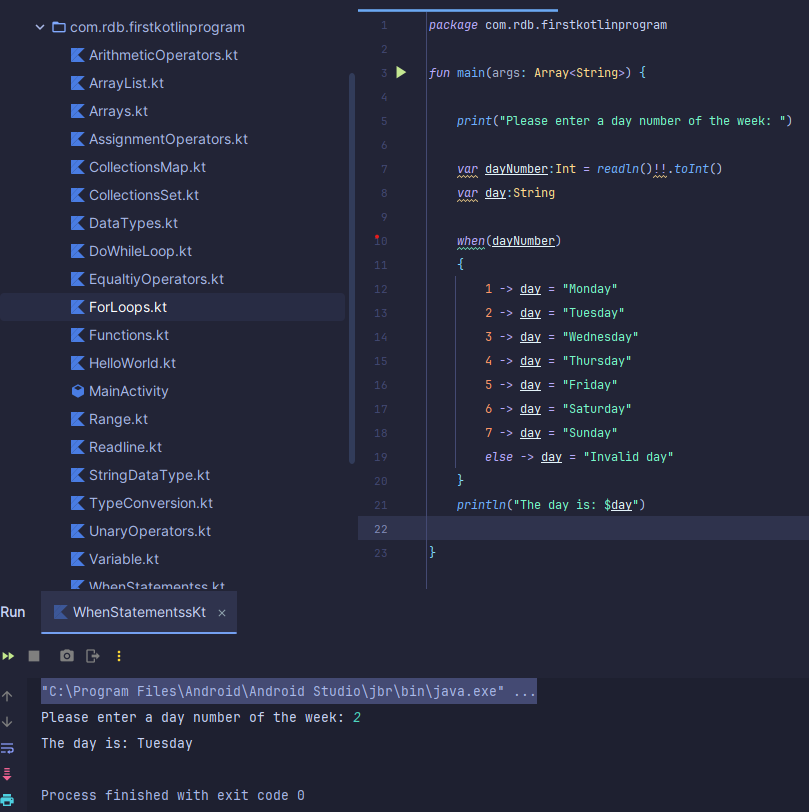

4. **Operators, Control Flow Statements en Loops**

   - Tijdens deze hoofdstukjes heb ik geleerd over de verschillende operatoren, Control Flow Statements en Loops binnen Kotlin.
   - Ik heb geleerd over:
     - Arithmetic, Assignment, Unary, Equality, Relational, Conditional en Precedence operatoren
     - If-else (if ladder statement en nested if)
     - When statement
   - De code kan je [`hier`](Compose/Fundamentals_Operators_Flow_Loops_Functions/) terug vinden. - Hieronder vindt je foto's van deeltjes die ik het interessants vond.
     - 
     - 
     - 

5. **Object Oriented Programming OOP**

   - Tijdens dit hoofdstuk heb ik geleerd over de basis van Object Oriented Programming.
   - Ik heb geleerd over:
     - Classes, Access Modifiers, Naming Convention
     - Constructors, Encapsulation, Inheritance
     - Function overriding, Abstract Classes, interfaces
   - De code kan je [`hier`](Compose/ObjectOrientedProgramming/) terug vinden. - Hieronder vindt je foto's van deeltjes die ik het interessants vond.
     - 
     - 
     - 
     - 

6. **Introduction Jetpack Compose**

   - Tijdens dit hoofdstuk heb ik geleerd over Jetpack compose
   - Ik heb geleerd over:

     - Wat is jetpack compose
     - Waarom gebruiken we het:
       - Minder code
       - Versnelt het development process
     - Android ecosystem

7. **Jetpack Compose Components**

   - Tijdens dit hoofdstuk heb ik geleerd over de basis componenten voor het maken van een Jetpack compose applicatie.
   - Ik heb geleerd over hoe je deze componenten gebruikt:
     - Column, Box, Row
     - Arrangements en Alignments
     - Buttons, TextFields, Images, Checkbox
     - Radio Buttons, Switch, Dropdown Menu
   - De code kan je [`hier`](Compose/Components/) terug vinden.
   - Hieronder vindt je wat foto's van de programma's die ik heb gemaakt tijdens dit hoofdstuk.
   - Dit programma laat een afbeelding zien en moet je in de inputfield je naam schrijven. Als je dan op "do your magic" knop duwt veranderd de foto en komt je naam in de label staan.

     - 
     - 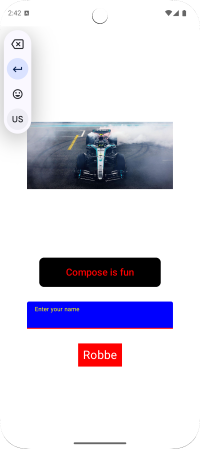
     - 
     - Dit programma is een simpel programma waarbij je met een switch de afbeelding kan laten verdwijnen.
     - 
     - 
     - 

8. **Jetpack Compose user Interactions**

   - Tijdens dit hoofdstuk heb ik geleerd over wanneer users handelingen doen in een app je bepaalde meldingen kan laten zien waar de user eventueel een keuze in moet maken of gewoon een medling met wat de user heeft gedaan.
   - Ik heb geleerd over hoe je deze componenten gebruikt:
     - Toast, Snackbar, Dialog Messages
     - Top App Bar, Options Menu
   - De code kan je [`hier`](Compose/User_Interactions/) terug vinden.
   - Hieronder vindt je wat foto's van de programma's die ik heb gemaakt tijdens dit hoofdstuk.
   - Dit programma heeft een knop als je erop drukt krijg je een dialog message waar je dan NO of YES kan kiezen.
     - 
     - 
     - 

9. **Jetpack Compose Navigation**

   - Tijdens dit hoofdstuk heb ik geleerd over hoe je moet navigeren tussen verschillende pagina's in een app.
   - Ik heb geleerd over hoe je deze componenten gebruikt:
     - Jetpack Compose Navigation
   - De code kan je [`hier`](Compose/Navigation/) terug vinden.
   - Hieronder vindt je wat foto's van de programma's die ik heb gemaakt tijdens dit hoofdstuk.
   - Dit programma moet je jouw naam en leeftijd ingeven en als je dan op send duwt ga je naar een andere pagina waar dan jouw naam en leeftijd op komt
     - 
     - 
     - 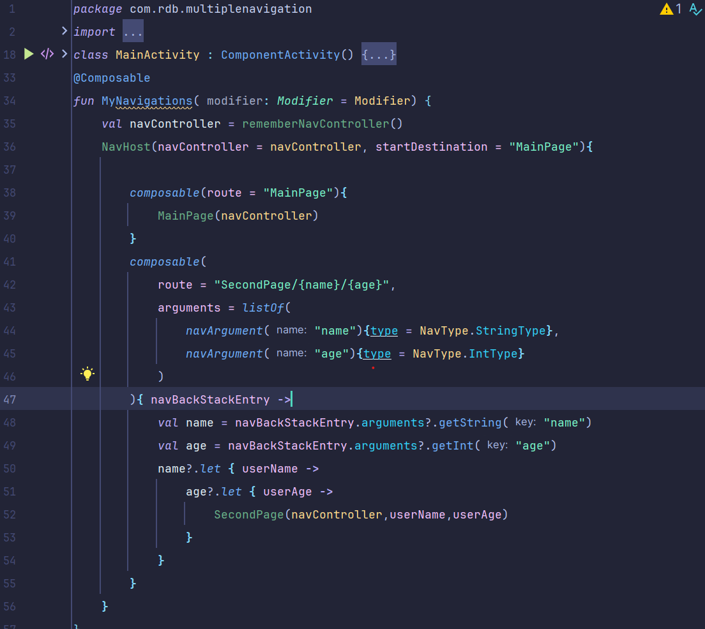

10. **Jetpack Compose Lists**

    - Tijdens dit hoofdstuk heb ik geleerd over data kunt laten zien op verschillende manieren. Zoals in een lijst horitzontaal of verticaal. En hoe je die data in een kaartje kunt laten zien.
    - Ik heb geleerd over hoe je deze componenten gebruikt:
      - Lazy Column
      - Lazy Row en Lazy Grid
    - De code kan je [`hier`](Compose/Lists/) terug vinden.
    - Hieronder vindt je wat foto's van de programma's die ik heb gemaakt tijdens dit hoofdstuk.
    - Dit programma laat een lijst van allemaal landen zien. Wanneer je op het pijltje naast zo'n land duwt ga je naar een tweede pagina met meer gegevens van dat land.
      - 
      - 
      - Dit is een foto van mijn landen dataset:
        
      - Dit is een foto van de detailpagina van een land:
        

11. **Project 1**

    - Tijdens dit hoofdstuk heb ik mijn eerste grote project gemaakt waar de vorige hoofdstukken in een programma komen.
    - Dit project is een ToDoList app waar je je eigen todolist kan maken.
    - De code kan je [`hier`](Compose/TODOList/) terug vinden.
    - Hieronder vindt je wat foto's de todolist.
    - 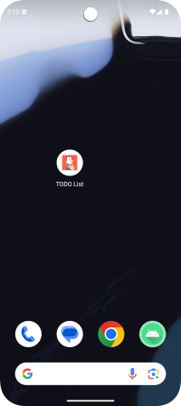
    - 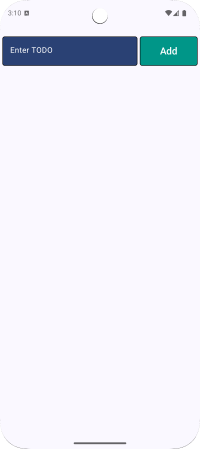
    - 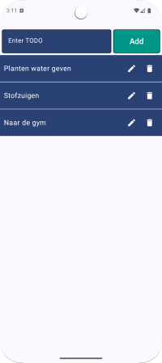
    - 
    - Dit is een foto van de filehelper die er voor zorgt dat alles goed wordt opgeslagen:
      

12. **Publiceren van een app op Google Play**

    - Tijdens dit hoofdstuk heb ik geleerd hoe ik apps op de Google Play Store moet zetten.
    - Op dit moment ben ik mijn apps erop aant zetten maar dat process duurt even.
    - Op deze foto kan je al zien dat mijn app op de play store staat maar wel alleen voor internal tester nog niet voor het grote publiek. (zodra het openbaar sta zet ik de link hier)
    - 

13. **Project 2**

    - Tijdens dit hoofdstuk heb ik mijn tweede grote project gemaakt waar de vorige hoofdstukken in een programma komen.
    - Dit project is een Wiskunde spel, waar je verschillende wiskundige vragen krijgt en deze zo snel mogelijk goed moet beantwoorden
    - De code kan je [`hier`](Compose/MathGame/) terug vinden.
    - Hieronder vindt je wat foto's de Math Game.
    - 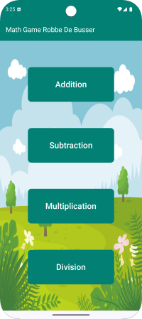
    - 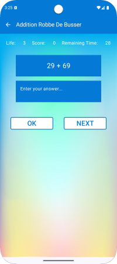
    - 
    - 
    - Dit is een foto van de logica van mijn spel:
      

### 🎨 XML-based UI met Android Studio Designer

14. **Android Studio Interface & XML UI**

- In dit hoofdstuk heb ik geleerd dat je de apps ook op een andere manier kunt maken. Via de android studio designer. Zo kan je eigenlijk de verschillende componenten gewoon slepen, dat maakt het programmeren van de apps vele visueler dan weet je exact hoe je app eruit ziet voordat je de app opstart.

15. **Android Components**

- Tijdens dit hoofdstuk heb ik geleerd over de basis android components maar nu via de designer.
- Ik heb geleerd over hoe je deze componenten gebruikt:
  - Layouts, Constraint layout
  - Textviews, buttons, editTexts
  - ImageView, checkbox, radio buttons
  - toggle buttons, spinner
- De code kan je [`hier`](Designer/Components/) terug vinden.
- Hieronder vindt je wat foto's van de programma's die ik heb gemaakt tijdens dit hoofdstuk.
- Dit is een voorbeeld van de designer in android studio
  - 

16. **Android User Interactions en Lists&Views**

- Tijdens dit hoofdstuk heb ik geleerd over hoe de lists en views werken.
- Ik heb geleerd over hoe je deze componenten gebruikt:
  - Layouts, Constraint layout
  - Textviews, buttons, editTexts
  - ImageView, checkbox, radio buttons
  - toggle buttons, spinner
- De code kan je [`hier`](Designer/Components/) terug vinden.
- Hieronder vindt je wat foto's van de programma's die ik heb gemaakt tijdens dit hoofdstuk.
- Dit is een foto van de designer van het programma
  - 
  - 
  - 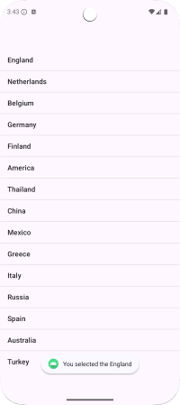
  - Dit programma maakt gebruik van een recycler view waarbij je maar één card moet maken en die kan dan herbruikt worden voor al je data. 
  - 
  - 

17. **Android Intent en Lifecycles**

- Tijdens dit hoofdstuk heb ik geleerd over het implementeren van intents, lifecycles, services en receivers. Dit hoofdstuk is niet zo visueel maar meer backend hoe services opstarten en zich daarna gedragen.

- Ik heb geleerd over hoe je deze componenten implementeert:

  - Intent
    - Een Intent is een berichtensysteem in Android waarmee je kunt navigeren tussen activiteiten of gegevens kunt delen tussen apps. Er zijn expliciete intents (gericht op een specifieke component) en impliciete intents (voor algemene acties zoals het openen van een webpagina).
    - 
      
  - Application-Activity-Fragment Lifecycles
    - De lifecycle bepaalt de verschillende stadia waarin een applicatie, activiteit of fragment zich bevindt, zoals gecreëerd, gestart, gepauzeerd en vernietigd. Door de lifecycle correct te beheren, voorkom je crashes en optimaliseer je prestaties.
    - 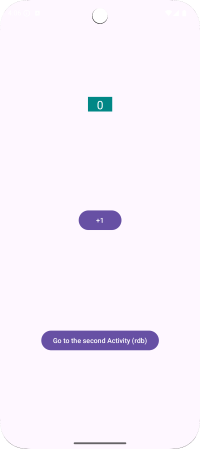
      
      
  - Services
    - Een Service is een achtergrondcomponent in Android die taken uitvoert zonder een gebruikersinterface, zoals het afspelen van muziek of het synchroniseren van gegevens. Er zijn twee soorten services: gestart (start op aanvraag) en gebonden (interageert met andere componenten).
    - 
      
  - Receivers
    - Broadcast Receivers vangen systeem- of app-brede berichten op, zoals het detecteren van een verandering in de vliegtuigmodus of een inkomend bericht. Ze werken op de achtergrond en worden vaak gebruikt voor reactieve functionaliteiten.
    - 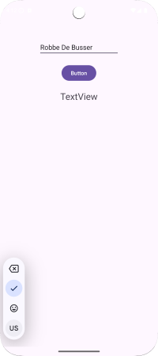
      
  - Android View Binding
    - View Binding is een functie in Android die het gebruik van findViewById() vervangt door type-veilige referenties naar UI-elementen. Dit vermindert boilerplate-code en voorkomt NullPointerException-fouten.

- De code kan je [`hier`](Designer/Intent&Lifecycles/) terug vinden.

18. **Android SharedPreferences, Data Saving en Device Compatibility**

- Tijdens deze hoofdstukjes heb ik geleerd over user data lokaal opslaagt. Ook hoe je verschillende talen kunt instellen in je programma.
- Ik heb geleerd over hoe je deze componenten implementeert:
  - SharedPreferences class
  - Saving Data local, calling back data
  - Multiple language, screen sizes support
- De code kan je [`hier`](Designer/MultipleLanguages/) terug vinden.
- Hieronder vindt je wat foto's van de programma's die ik heb gemaakt tijdens dit hoofdstuk.
  - Dit is een foto mijn programma in EN-US taal  
    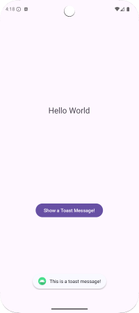
  - Dit is een foto mijn programma in nl-rBE taal  
    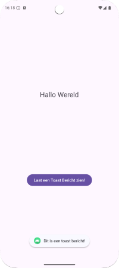
  - De tekst van de verschillende talen word per taal apart opgeslagen in een strings.xml bestan.
    
    

19. **Project 3**

    - Tijdens dit hoofdstuk heb ik mijn derde grote project gemaakt waar de vorige hoofdstukken in een programma komen.
    - Dit project is eigenlijk hetzelfde als project 1 alleen op een andere manier geprogrammeerd.
    - De code kan je [`hier`](Designer/ToDoListDesigner/) terug vinden.
    - Hieronder vindt je wat foto's de todolist.
    - Dit is een foto van de designer editor:
      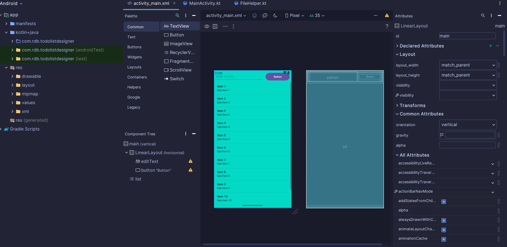
    - 
    - 
    - 
    - Dit is een foto van de filehelper die er voor zorgt dat alles goed wordt opgeslagen:
      

20. **Project 4**

    - Tijdens dit hoofdstuk heb ik mijn vierde grote project gemaakt waar de vorige hoofdstukken in een programma komen.
    - Dit project is eigenlijk hetzelfde als project 2 alleen op een andere manier geprogrammeerd.
    - De code kan je [`hier`](Designer/MathGameDesigner/) terug vinden.
    - Hieronder vindt je wat foto's de Math Game.
    - Dit is een foto's van de designer editor van de verschillende pagina's:
      
      
    - Dit zijn foto's van mijn programma zelf op de gsm.  
      
      
      
    - Dit zijn foto's van mijn code.
      
      
      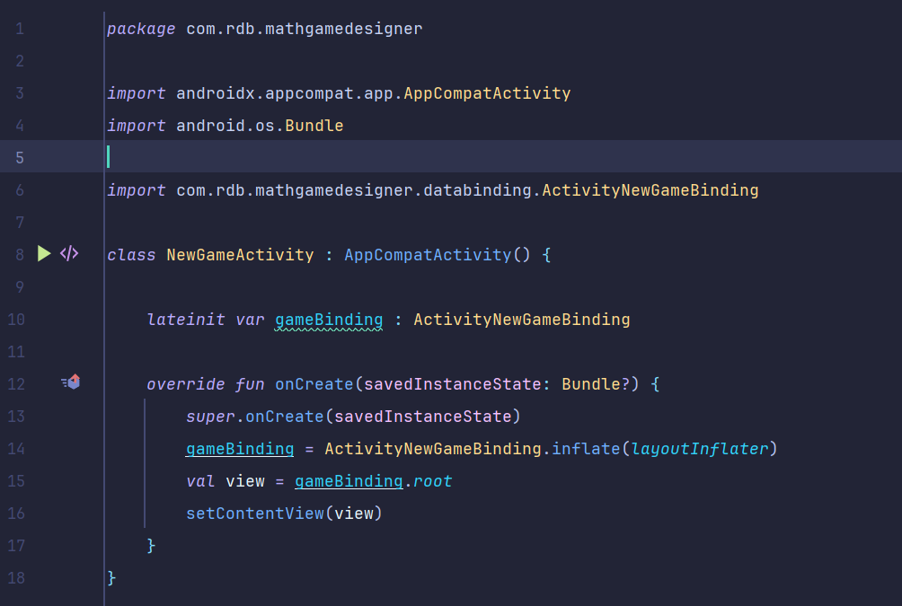

## 📜 Certificaat

- Na het bekijken van alle video's en het invullen van alle quizjes en het maken van alle oefeningen/projecten heb ik een certificaat behaalt. Die kan je [`hier`](https://www.udemy.com/certificate/UC-3a80e234-e789-4b12-b964-e0f1217bf857/) vinden of op de foto hieronder.
  

## 📌 Reflectie

- Ik vond deze cursus zeer leuk omdat ik al zeer geïnteresseerd was in mobile development. Ik heb tijdens deze cursus een aantal zeer leuke projecten gemaakt die hopelijk binnenkort op de Google Play Store staan.
